# MSCS 634 – Advanced Big Data and Data Mining
## Project Deliverable 4: End-to-End Machine Learning on the Framingham Heart Study Dataset

---

## Overview

For this project, I worked with the **Framingham Heart Study** dataset to build a complete data mining and machine learning pipeline. The goal was to predict the 10-year risk of coronary heart disease (CHD) and explore the dataset through regression, classification, clustering, and association rule mining. This README walks through the dataset, the steps I followed, the visualizations I produced, and what I found.

---

## Dataset Summary

| Property | Detail |
|---|---|
| **Name** | Framingham Heart Study |
| **Source** | Kaggle ([aasheesh200/framingham-heart-study-dataset](https://www.kaggle.com/datasets/aasheesh200/framingham-heart-study-dataset)) |
| **Records** | 4,240 patients |
| **Features** | 15 input features + 1 binary target |
| **Target Variable** | `TenYearCHD` — binary (0 = No CHD, 1 = CHD Risk) |

### Features

The dataset contains a mix of clinical measurements and lifestyle factors:

- **Demographics:** `age`, `male`, `education`
- **Lifestyle:** `currentSmoker`, `cigsPerDay`
- **Medical History:** `BPMeds`, `prevalentStroke`, `prevalentHyp`, `diabetes`
- **Clinical Measurements:** `totChol`, `sysBP`, `diaBP`, `BMI`, `heartRate`, `glucose`

### Class Imbalance

One of the first things I noticed during exploratory analysis was a significant class imbalance in the target — about 85% of patients had no CHD risk and only 15% were at risk. This influenced my modeling choices throughout: I used `class_weight='balanced'` and prioritized F1 and AUC over plain accuracy.

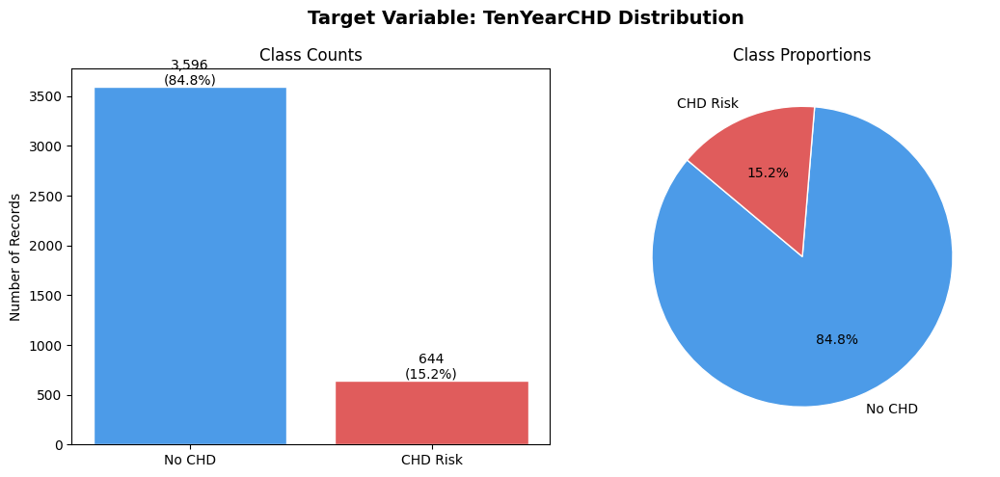

The bar chart and pie chart above confirm the imbalance clearly. A naive model that always predicts "No CHD" would score ~85% accuracy while being completely useless, which is exactly why raw accuracy is misleading here.

---

## Project Steps

### Step 1: Data Preprocessing

Before any modeling, I spent time cleaning and preparing the data.

#### Missing Value Imputation

Seven columns had missing values, with `glucose` being the worst at 9.15%. I compared three strategies — mean, median, and KNN — and chose **median imputation** for numeric columns. The chart below shows why: glucose has a significant right skew, which pulls the mean (82.0) away from the true center. The median (78.0) is a more representative fill value for skewed data.

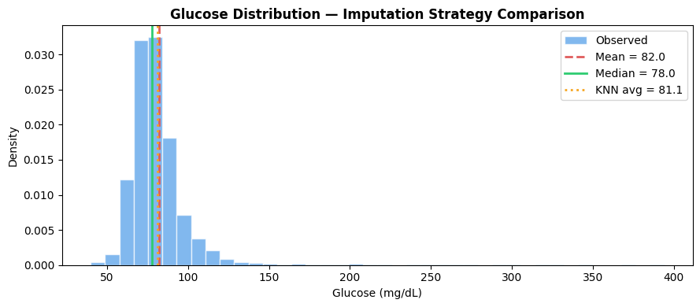

#### Outlier Treatment

I detected outliers using the **IQR method** and handled them via **Winsorization** — capping values at the 1st and 99th percentiles using `pandas.Series.clip()`. This approach let me keep all 4,240 records. The boxplots below show the feature distributions post-winsorization: the extreme tails are tamed, but the core shape of each distribution is preserved.


**No duplicates** were found in the dataset.

---

### Step 2: Exploratory Data Analysis (EDA)

#### Feature Distributions

The histograms below show the distribution of all eight numeric features with KDE curves and skewness labels. `glucose` (skew=2.52) and `cigsPerDay` (skew=1.14) stand out as heavily right-skewed — both needed log transformations in the feature engineering step. `age` and `heartRate` are relatively well-behaved.

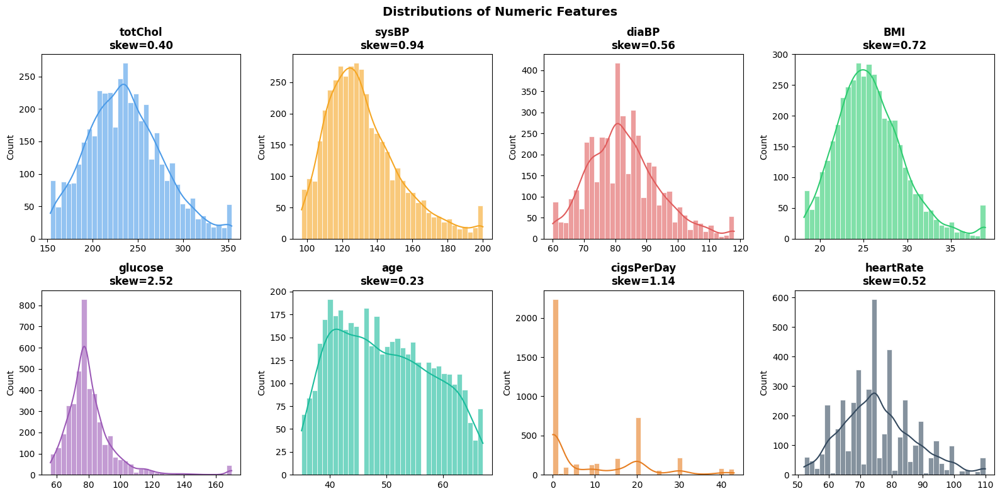

#### Binary Feature Prevalence

Nearly half the dataset (49.4%) are current smokers, and 42.9% are male. Prevalent hypertension affects 31.1% of patients — a significant proportion. Diabetes, BPMeds, and prevalent stroke are each present in under 3% of patients.

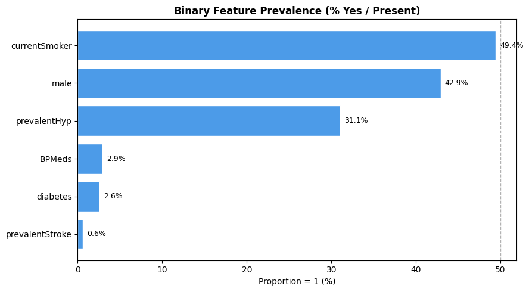

#### Numeric Features by CHD Status

The grouped boxplots below compare each numeric feature between patients with and without CHD risk. The clearest separation is in **age** (median 48 for No CHD vs. 55 for CHD) and **sysBP** (median 127 vs. 139). Blood pressure and age both show consistent upward shifts for CHD patients, while `glucose` and `heartRate` show almost no difference.


#### CHD Rate by Binary Risk Factor

This chart puts hard numbers on the risk each flag carries. Patients with **prevalent stroke** had a CHD rate of 44% — nearly three times the baseline. **Diabetes** pushed the rate to 36.7%, and **BPMeds** to 33.1%. Even `currentSmoker`, often assumed to be a strong predictor, only marginally elevated the rate from 14.5% to 15.9%.

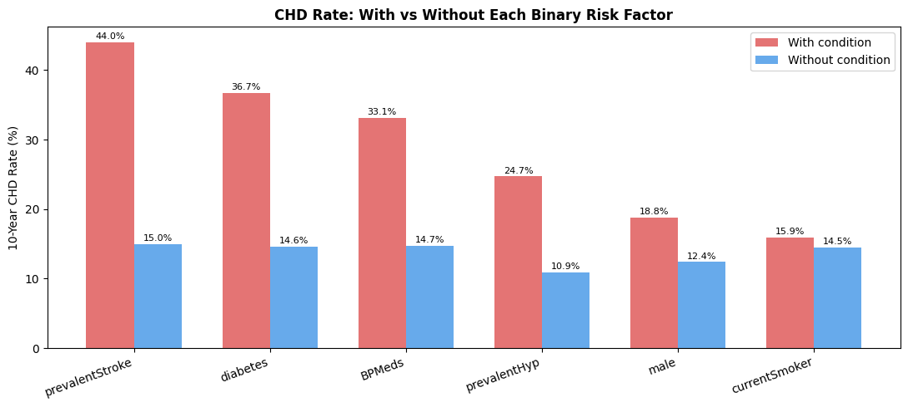

#### Age Distribution by CHD Status

This was one of the most striking EDA plots. The No CHD density curve peaks sharply around age 40, while the CHD Risk curve peaks later, around age 58–60. The two distributions barely overlap in the older age ranges, which foreshadowed age becoming the dominant predictor in the classification models.


---

### Step 3: Feature Engineering

I created five new features to capture domain knowledge and address skewness.

| New Feature | How I Made It | Why |
|---|---|---|
| `log_glucose` | `log1p(glucose)` | Original skew = 2.52; log normalizes it |
| `log_cigsPerDay` | `log1p(cigsPerDay)` | Skew + zero-inflation; log handles both |
| `age_squared` | `age²` | Captures non-linear age effect on blood pressure |
| `pulse_pressure` | `sysBP - diaBP` | Standard clinical metric for vascular stiffness |
| `hypertension_risk_score` | Normalized composite of age, BMI, cholesterol, diabetes, hypertension | Summarizes multi-factor hypertension risk |

The 2×2 grid below compares original vs. log-transformed distributions for `glucose` and `cigsPerDay`. The skew for `cigsPerDay` drops from 1.14 to 0.32 after transformation — a big improvement.


The scatter plots below show each engineered feature against the regression target `sysBP`. The `hypertension_risk_score` (bottom right) shows the clearest upward trend — patients with higher composite scores consistently have higher systolic BP. `age_squared` also shows a gradual positive relationship.


---

### Step 4: Regression — Predicting Systolic Blood Pressure

I treated `sysBP` as a regression sub-task using three models:

- **Linear Regression** (baseline)
- **Ridge Regression** (L2 regularization, α tuned)
- **Lasso Regression** (L1 regularization, α tuned)

**Results (Test Set):**

| Model | R² | RMSE | MAE |
|---|---|---|---|
| Linear Regression | 0.5392 | 13.98 mmHg | 10.66 mmHg |
| Ridge (α=59.6) | 0.5392 | 13.98 mmHg | 10.66 mmHg |
| **Lasso (α=0.069)** | **0.5411** | **13.95 mmHg** | **10.65 mmHg** |

Lasso edged ahead by trimming less-informative features via L1 shrinkage. The models collectively explain about **54% of the variance** in systolic blood pressure.

#### Actual vs. Predicted

All three models produce nearly identical scatter plots. Points cluster reasonably along the diagonal (perfect prediction line), with more spread at higher blood pressure values — the models underpredict extreme readings.


#### Cross-Validation Stability

The 10-fold cross-validation boxplots below confirm that all three models generalize stably: R² stays tightly around 0.56 and RMSE stays around 14.2 mmHg across all folds. There's virtually no difference between the three models in terms of variability.


#### Feature Coefficients

`prevalentHyp` dominates all three models with a standardized coefficient around 9–10. Lasso actually amplifies it further (~10.7), while shrinking many of the less-informative features closer to zero. This confirms Lasso's feature selection behavior — it concentrates weight on the most predictive variables.

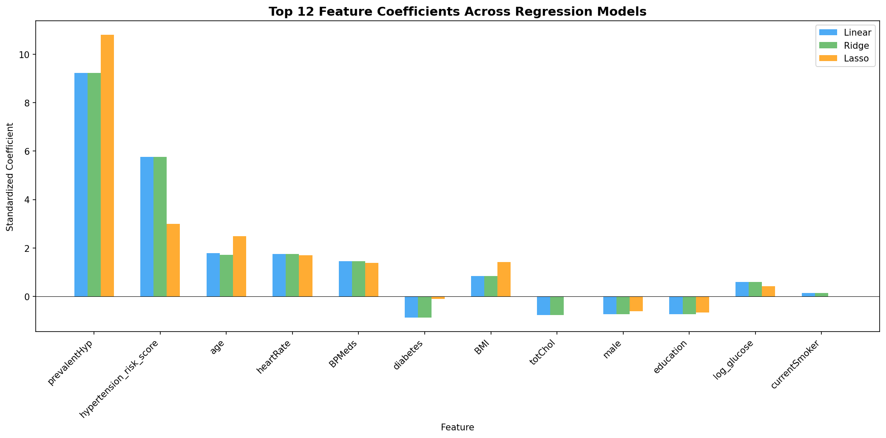

#### Regularization Path

The plot below is important for understanding *why* Lasso performs slightly better. Ridge (green) stays flat across a huge range of alpha values — it's very insensitive to regularization strength. Lasso (orange) holds steady at low alpha values, then collapses to zero around α=10. The optimal Lasso alpha (marked by the dashed vertical line) sits right before that cliff, getting the best of both worlds: slight feature shrinkage without over-penalizing.

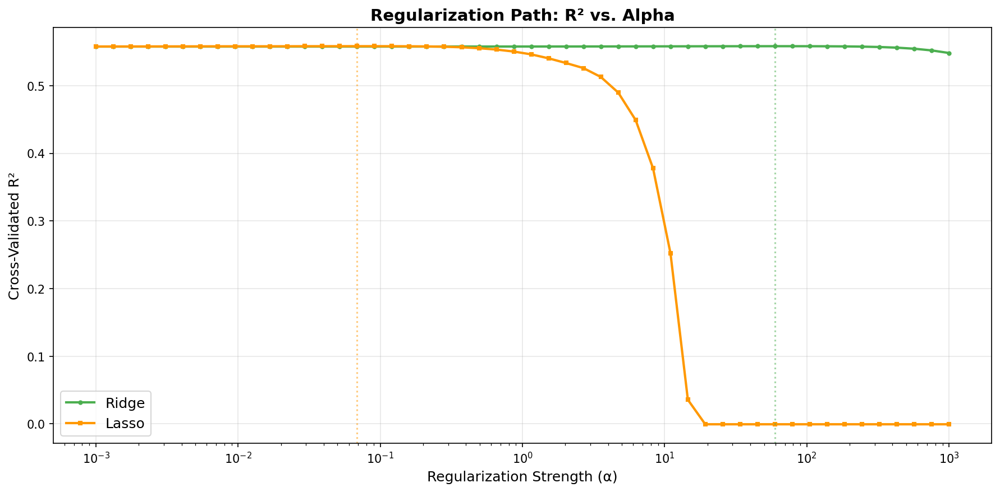

---

### Step 5: Classification — Predicting 10-Year CHD Risk

The main prediction task. I used two classifiers:

- **Decision Tree** (baseline + GridSearchCV tuning)
- **k-Nearest Neighbors** (k tuned from 3 to 29)

**Hyperparameter Tuning (Decision Tree):**
I ran a 5-fold StratifiedKFold GridSearchCV over:
- `max_depth`: [3, 5, 7, 10]
- `min_samples_split`: [10, 20, 50]
- `min_samples_leaf`: [5, 10, 20]
- `criterion`: ['gini', 'entropy']

Best config: `max_depth=5, min_samples_split=20, min_samples_leaf=5, criterion='entropy'`

#### k-NN: Finding the Best k

CV F1 peaks at **k=5** (F1≈0.20) and drops steadily as k increases — more neighbors smooth out the decision boundary too much and the model misses CHD cases entirely. k=5 was selected.

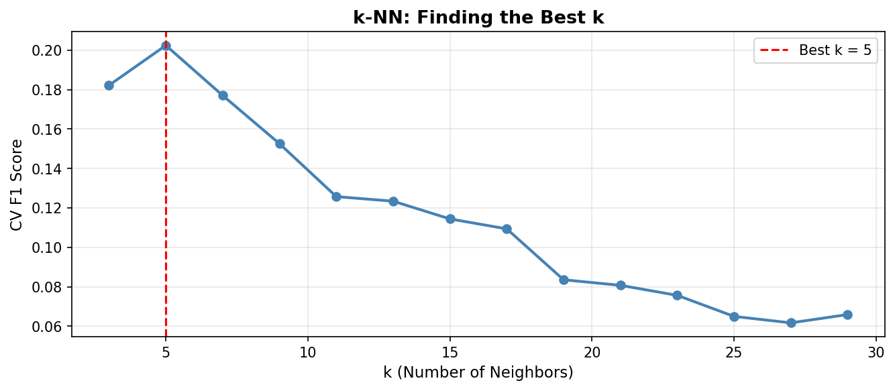

#### Decision Tree Structure

The tuned tree's top 3 levels reveal the model's core logic. The root split is **age** (≤ 0.37 normalized), confirming it as the primary decision point. From there, the left branch (younger patients) further splits on `hypertension_risk_score`, and the right branch (older patients) splits again on `hypertension_risk_score` and `sysBP`. The orange nodes lean toward CHD risk, blue nodes toward No CHD.

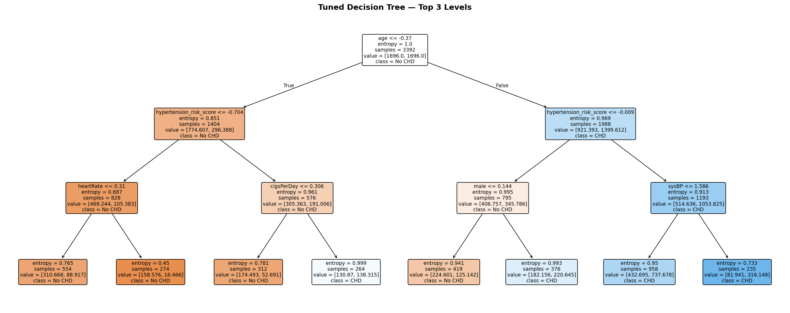

#### Model Comparison

The bar chart below shows the full three-model comparison. k-NN (k=5) looks impressive on accuracy (~0.83) but has the worst F1 score (~0.15) — it's predicting "No CHD" almost all the time. The Tuned Decision Tree achieves the best AUC and a much more balanced F1, making it the most useful model in practice.


**Results Table:**

| Model | Accuracy | F1 Score | ROC-AUC |
|---|---|---|---|
| Decision Tree (Baseline) | 0.7557 | 0.3826 | 0.6985 |
| **Decision Tree (Tuned)** | **0.7663** | **0.4062** | **0.7191** |
| k-NN (k=5) | 0.7571 | 0.3795 | 0.6944 |

#### Confusion Matrices

The side-by-side confusion matrices make the tradeoff crystal clear. The **Tuned Decision Tree** (left) catches 93 true CHD cases (TP) but at the cost of 345 false positives. The **k-NN** model (right) barely predicts CHD at all — only 12 true positives — making it nearly useless for identifying at-risk patients despite its higher accuracy.

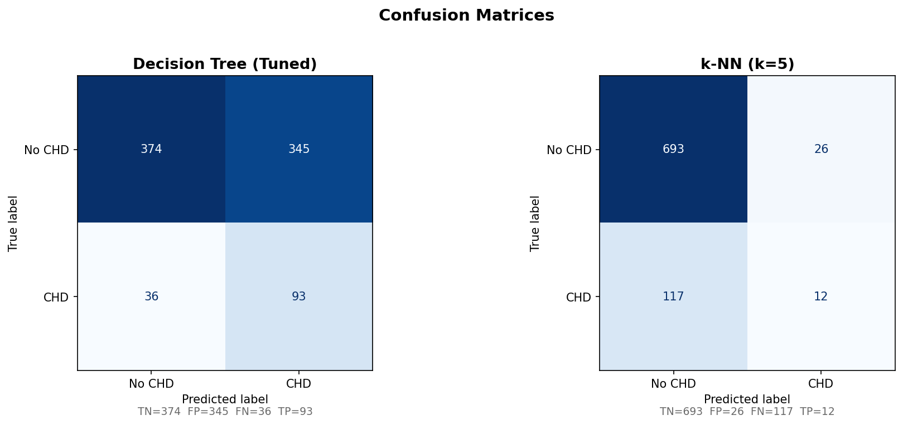

#### Feature Importance

`age` (0.5407) and `hypertension_risk_score` (0.2517) together account for nearly **80%** of the Decision Tree's decision-making. Everything else — smoking, systolic BP, sex — contributes only marginally. The engineered `hypertension_risk_score` feature proved its worth here by ranking second overall.

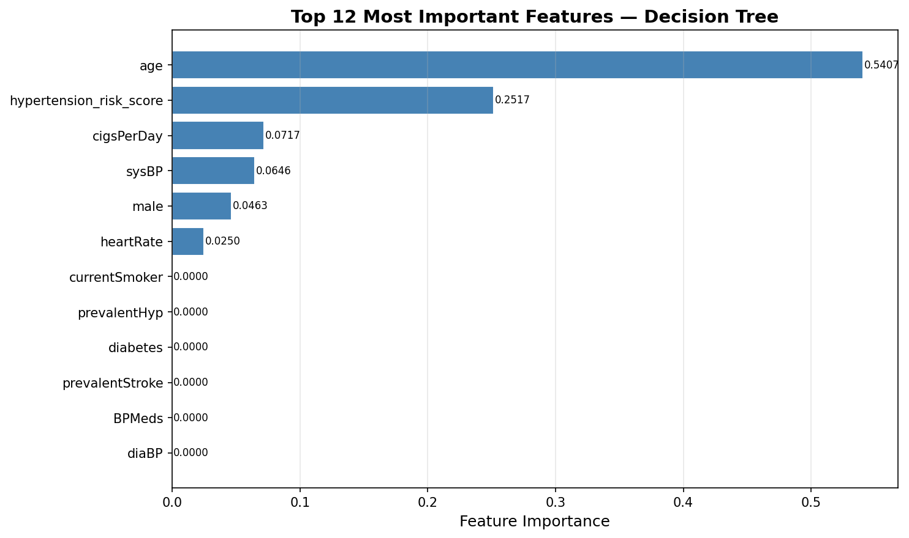

---

### Step 6: Clustering — Unsupervised Risk Segmentation

I applied **K-Means clustering** to group patients without using the CHD label, then checked whether the clusters correlated with actual CHD rates.

#### Choosing k

The elbow method (left) doesn't show a sharp bend, indicating gradual returns. The silhouette score (right) peaks at k=2 but k=3 was chosen because it produces three clinically interpretable groups rather than just a binary split.


#### Cluster Profiles

The heatmap below shows the average feature values for each cluster. The differences are clinically meaningful:
- **Cluster 1** (age=42.6, sysBP=118.6) — younger, lower blood pressure → **Low Risk (6.8% CHD)**
- **Cluster 0** (age=54.7, sysBP=128.5) — older, moderate blood pressure → **Moderate Risk (17.2% CHD)**
- **Cluster 2** (age=53.3, sysBP=158.5, diaBP=96.8) — older, high blood pressure across the board → **High Risk (25.4% CHD)**

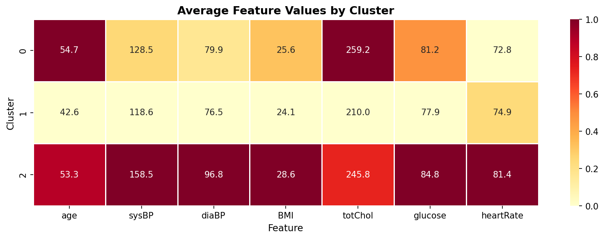

#### PCA Visualization

Projecting the clusters into 2D PCA space (PC1+PC2 explain ~49% of variance) shows reasonable separation between the three groups. The right panel overlays the actual CHD outcomes — CHD cases (red dots) are clearly concentrated in the Cluster 2 (High Risk) region, validating that the unsupervised grouping aligned with the true labels.

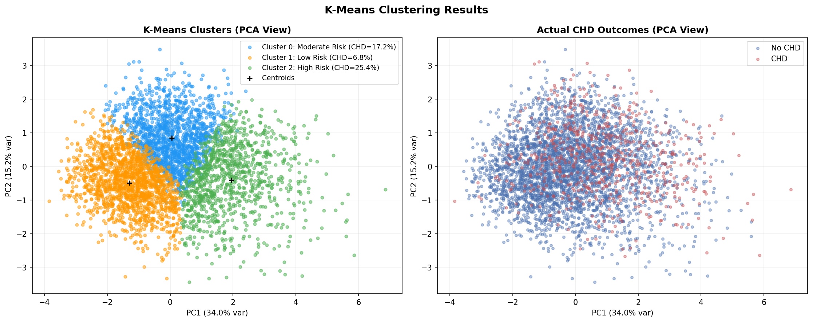

#### Feature Distributions by Cluster

The boxplots confirm the cluster differences quantitatively. Cluster 2 stands out most clearly on `sysBP` (median ~158 vs ~128 for Cluster 0 and ~118 for Cluster 1) and `diaBP`. The CHD rate bar chart in the top-left corner summarizes it directly: 6.8% → 17.2% → 25.4% across the three risk tiers.


---

### Step 7: Association Rule Mining — Pattern Discovery

Using the **Apriori algorithm** (min_support=0.02, max_len=3), I converted continuous features into binary risk flags and mined for co-occurring patterns.

**Binary Risk Flags Defined:**

| Flag | Condition |
|---|---|
| Hypertensive | sysBP ≥ 140 |
| Obese | BMI ≥ 30 |
| HighChol | totChol ≥ 240 |
| HighGlucose | glucose ≥ 126 |
| OlderAge | age ≥ 55 |
| HeavySmoker | cigsPerDay ≥ 15 |
| FastHeartRate | heartRate ≥ 80 |

**Summary of Results:**
- **166 frequent itemsets** found (11 single-item, 109 pairs, 46 triples)
- **130 total association rules** generated
- **28 rules** with `CHD_Risk` as the consequent

#### Support vs. Confidence — All Rules

The scatter plot below shows all 130 rules, colored by lift. The rules with the highest lift (darkest red) tend to cluster at low-to-moderate support values — they're not the most common patterns, but they're the most predictive ones. Several high-confidence rules appear at the top of the chart, and the coloring reveals these aren't just frequent co-occurrences but genuinely elevated associations.

On the right, the top CHD risk rules ranked by lift show that **Hypertensive**, **PrevalentHyp**, and their combinations with **OlderAge** and **HeavySmoker** dominate the leaderboard.

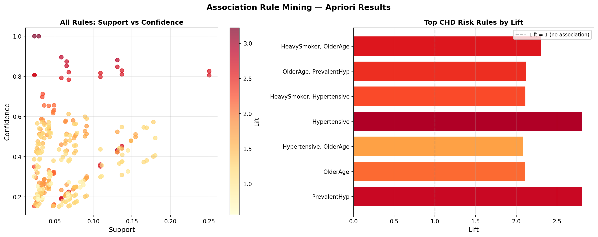

#### Top CHD Risk Rules — Heatmap

The heatmap below gives the most precise view of the top 15 rules leading to CHD. The two strongest: `Hypertensive → CHD_Risk` (lift=**2.814**, confidence=0.216) and `PrevalentHyp → CHD_Risk` (lift=**2.813**, confidence=0.210) — both nearly tripling the expected CHD rate. Combinations like `HeavySmoker + OlderAge → CHD_Risk` (lift=2.303) and `OlderAge + PrevalentHyp → CHD_Risk` (lift=2.118) show that risk factors compound each other significantly.


---

## Major Findings

1. **Age is the strongest single predictor of CHD risk** — feature importance of 0.54, confirmed by the EDA age KDE plot and the Decision Tree root split.

2. **Lasso regression best predicted systolic blood pressure** — R²=0.54, RMSE≈14 mmHg on the test set. The regularization path plot explained why: Lasso's feature selection gave it a slight edge over Ridge and Linear Regression.

3. **Tuned Decision Tree outperformed k-NN** for CHD classification — F1=0.41, AUC=0.72. The confusion matrices showed k-NN barely detected CHD at all (12 true positives vs. 93 for the Decision Tree).

4. **K-Means naturally recovered three clinically meaningful patient tiers** — CHD rates of 6.8%, 17.2%, and 25.4% emerged without ever seeing the CHD label, validated by the PCA overlay plot.

5. **Risk factors compound** — The association rule heatmap showed `Hypertensive` alone lifts CHD risk by 2.81×, but combinations like `HeavySmoker + OlderAge` (lift=2.30) and `OlderAge + PrevalentHyp` (lift=2.12) reveal that co-occurring conditions are especially dangerous.

6. **Class imbalance requires careful handling** — k-NN's high accuracy (~83%) masked near-total failure to detect CHD patients. F1 and AUC told the real story.

---

## Project Structure

```
MSCS_634_Project/
├── MSCS_634_Project_Deliverable4.ipynb   # Main notebook
├── Visualizations/                        # All exported plots
└── README.md                             # This file
```
